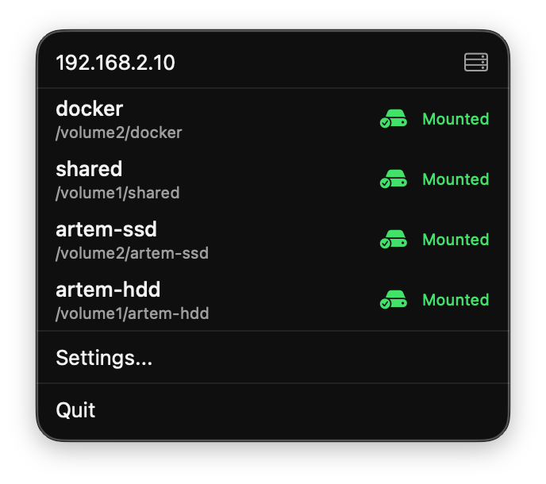
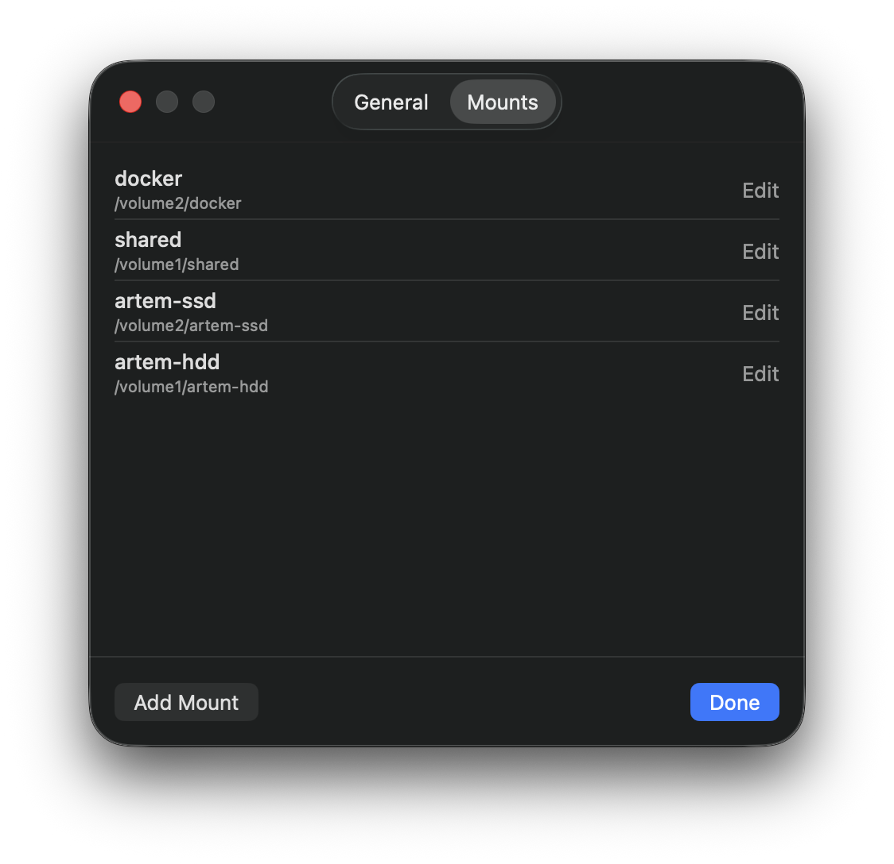

# MacNAS

A macOS menu bar app that keeps NFS mounts to your NAS alive.

NFS mounts on macOS break constantly — after sleep/wake, network blips, or server restarts — leaving you with stale file handles, hanging Finder windows, and no way to recover without manual intervention. macOS provides no built-in tool to manage or monitor NFS mounts.

MacNAS fixes this. It mounts your NFS shares, monitors their health, and automatically recovers from failures. It blocks Spotlight indexing on NFS volumes to prevent mount thrashing. It tells you when something goes wrong that it can't fix.

NFSv3 only. Requires macOS 14.0+ (Sonoma).

<p align="center">
  
  &nbsp;&nbsp;
  
</p>

## Install

```sh
brew tap tartakynov/macnas https://github.com/tartakynov/macnas.git
brew install --cask macnas
xattr -cr /Applications/MacNAS.app
```

Or build from source:

```sh
make
open .build/release/MacNAS.app
```

On first launch, MacNAS prompts for your administrator password to install a privileged helper daemon that performs mount/unmount operations.

## Configure

Click the menu bar icon, then **Settings**.

- **Server IP** — your NAS IP address
- **Mount Root** — where mounts appear locally (default: `/Volumes/NAS`)
- **Mounts** — add NFS exports with their local mount names (e.g. export `/volume1/media` as `media`)

Configuration is stored at `~/Library/Application Support/MacNAS/config.json`.

## How It Works

- Mounts NFS shares using NFSv3 over TCP with `nobrowse`/`nodev`/`nosuid`
- Polls mount health every 15 seconds (configurable): check if mounts are still available
- Automatically remounts missing shares; force-unmounts and remounts stale or unreachable ones
- Triggers immediate health checks after sleep/wake and network changes
- Blocks Spotlight indexing on each mount to prevent mount thrashing

## Uninstalling

This removes the app, stops the helper daemon, and deletes the helper binary:

```sh
brew uninstall --cask macnas
```

To verify the helper was fully removed:

```sh
sudo launchctl print system/com.macnas.helper  # should say "Could not find service"
ls /usr/local/bin/com.macnas.helper            # should say "No such file or directory"
```

To remove configuration data:

```sh
brew zap macnas
```
